# Architecture

⚠️ **Important:** This document describes x402-dev's architecture as a **MOCK/TESTING TOOLKIT**. It does NOT include real Solana blockchain integration.

---

## Overview

x402-dev provides a development environment for testing HTTP 402 payment-protected APIs. The architecture consists of three layers: CLI, Mock Server, and Policy Engine.

**Key principle:** All "payment verification" is simulated for testing purposes. No actual blockchain transactions occur.

---

## System Architecture

```mermaid
graph TB
    CLI[CLI Layer<br/>x402-dev commands] --> Core[Core Library<br/>Policy & Testing]
    CLI --> Server[Mock Server<br/>402 Responses]
    CLI --> Config[Configuration<br/>YAML files]

    Server --> Handlers[Request Handlers<br/>Accept ANY proof]
    Server --> Invoice[Invoice Generator<br/>Test addresses only]

    Core --> Policy[Policy Engine<br/>YAML → Middleware]
    Core --> Tests[Test Framework<br/>YAML test suites]

    Config --> Project[Project Config<br/>.x402dev.yaml]
    Config --> Global[Global Config<br/>~/.x402dev/config.yaml]

    style Server fill:#ff9999
    style Invoice fill:#ff9999
    style Handlers fill:#ff9999
```



---

## Mock Payment Flow (Testing Only)

This diagram shows how x402-dev simulates the payment protocol **without any blockchain interaction**:

```mermaid
sequenceDiagram
    participant Client as Client/Test
    participant App as Your API
    participant Mock as x402-dev<br/>Mock Server

    Note over Mock: NO blockchain<br/>NO real verification

    Client->>App: GET /api/premium
    Note over App: No payment proof found

    App->>Mock: Request invoice
    Mock->>Mock: Generate test invoice<br/>(fake address from array)
    Mock-->>App: Mock invoice data

    App-->>Client: 402 Payment Required<br/>WWW-Authenticate: x402-solana recipient=Test123... amount=1000

    Note over Client: In real app, client would<br/>submit blockchain payment here

    Note over Mock: Mock server accepts<br/>ANY payment proof

    Client->>App: GET /api/premium<br/>X-Payment-Proof: literally-anything
    App->>Mock: Verify proof

    Mock->>Mock: No validation!<br/>Always returns success
    Mock-->>App: ✅ Payment verified (FAKE)

    App-->>Client: 200 OK + Premium content

    Note over Mock: Same proof can be<br/>reused infinitely (testing only!)
```



**Critical notes:**
- 🔴 No blockchain calls - `solana-client` not used
- 🔴 Test addresses only - from hardcoded array
- 🔴 No proof validation - accepts any string
- 🔴 No replay prevention - same proof works forever
- ✅ Perfect for testing - instant, deterministic

---

## Component Diagram


---

## Data Flow: Mock Invoice Generation


**Code evidence:**
```rust
// x402-server/src/handlers.rs
const TEST_ADDRESSES: &[&str] = &[
    "Test1234567890...",  // FAKE
    "Mock9876543210...",  // FAKE
    // ... 18 more
];

async fn verify_payment_success(payment_proof: String, _: String) -> HttpResponse {
    // NO BLOCKCHAIN CALL. Just accepts anything.
    println!("✅ Payment verification SUCCESS");
    HttpResponse::Ok().json(/* success */)
}
```

---

## Key Components

### 1. CLI Layer (`crates/x402-cli/`)

**Purpose:** User-facing command-line interface

**Commands:**
- `init` - Project setup with `.x402dev.yaml`
- `mock` - Start/stop mock payment server
- `test` - Run YAML test suites
- `check` - Validate 402 protocol compliance (no blockchain)
- `policy` - Generate middleware code from YAML
- `doctor` - System diagnostics
- `examples` - Browse example projects
- `version` - Version management
- `verify` - **STUB** (not implemented)
- `monitor` - **STUB** (not implemented)

**Technology:**
- Clap 4.5 for CLI parsing
- Colored terminal output
- Interactive prompts

---

### 2. Mock Server (`crates/x402-server/`)

⚠️ **Critical:** This is a MOCK server for testing. It does NOT verify real payments.

**What it does:**
- ✅ Returns HTTP 402 status codes
- ✅ Generates WWW-Authenticate headers
- ✅ Simulates payment flow (success/failure/timeout)
- ✅ Configurable pricing per route
- ❌ Does NOT connect to Solana blockchain
- ❌ Does NOT verify payment proofs
- ❌ Does NOT prevent replay attacks

**Technology:**
- Actix-web 4.x HTTP server
- Serde for JSON serialization
- Tokio async runtime

**Invoice generation:**
```rust
pub struct Invoice {
    pub recipient: String,      // From TEST_ADDRESSES array
    pub amount: u64,             // From pricing config
    pub currency: String,        // Hardcoded "USDC"
    pub memo: String,            // Random UUID
    pub network: String,         // HARDCODED "devnet"
    pub expires_at: DateTime,    // 5 min from now
}
```

---

### 3. Policy Engine (`crates/x402-core/src/policy/`)

**Purpose:** Convert YAML policies into middleware code

**Supported policies:**
- Rate limiting (requests per window)
- Spending caps (max amount per period)
- Allowlist/denylist (agent patterns)
- Custom rules (flexible conditions)

**Code generation:**
- Express.js middleware (JavaScript)
- Fastify plugins (JavaScript)
- 8x code multiplication (29 lines YAML → 224 lines JS)

**Example:**
```yaml
# Input: policy.yaml
policies:
  - type: rate_limit
    pattern: "/api/*"
    max_requests: 100
    window: 3600
```

```bash
x402-dev policy generate policy.yaml --framework express
# Output: middleware/policy.js (Express middleware)
```

---

### 4. Test Framework (`crates/x402-core/src/testing/`)

**Purpose:** YAML-based test automation for CI/CD

**Features:**
- 12 assertion types (status_code, header_exists, body_contains, etc.)
- Async test execution
- JUnit XML output
- JSON output for parsing
- <100ms overhead per test

**Example:**
```yaml
tests:
  - name: "Returns 402 without payment"
    request:
      url: "http://localhost:3402/api/data"
    assertions:
      - type: status_code
        expected: 402
      - type: header_exists
        header: "WWW-Authenticate"
```

---

### 5. Domain Layer (`crates/x402-domain/`)

**Purpose:** Type-safe domain types and validation

**Key types:**
- `Amount` - Decimal-based (prevents float rounding errors)
- `PolicyId`, `AgentId` - Validated identifiers
- `SolanaAddress` - Base58 validation (format only, not blockchain)
- `Configuration` - Multi-tier config loading

**Validation:**
- Address format (Base58 regex) - **NOT blockchain lookup**
- Amount range checking
- Policy conflict detection

---

## Configuration System

Multi-tier configuration with priority:

```
CLI flags > Environment variables > Project config > Global config > Defaults
```

### Configuration files:
1. **Project:** `.x402dev.yaml` (in current directory)
2. **Global:** `~/.x402dev/config.yaml` (user-wide)

### Example `.x402dev.yaml`:
```yaml
mock_server:
  port: 3402
  pricing:
    default: 0.01          # Default price
    "/api/premium": 0.10   # Route-specific pricing

solana:
  rpc_url: "https://api.devnet.solana.com"  # NOT USED (mock only)
  network: "devnet"                          # Hardcoded in code anyway

policy:
  file: "policy.yaml"

testing:
  output_format: "junit"
  fail_fast: false
```

---

## Security Considerations (Mock Mode)

### ⚠️ What's NOT Secure (Testing Only):

1. **No Payment Verification**
   - Accepts ANY `X-Payment-Proof` value
   - No cryptographic validation
   - No blockchain lookup

2. **No Replay Attack Prevention**
   - Same proof can be reused infinitely
   - No payment cache
   - No transaction tracking

3. **No Rate Limiting**
   - Unlimited requests accepted
   - No DDoS protection
   - No backpressure

4. **Test Addresses Only**
   - Hardcoded array of fake addresses
   - Not real Solana accounts
   - No wallet management

### ✅ What IS Secure (For Testing):

1. **Type Safety**
   - Rust's type system prevents many bugs
   - Validated types for critical data
   - No null pointer exceptions

2. **Error Handling**
   - Custom error types
   - Proper error propagation
   - Clear error messages

3. **Input Validation**
   - Address format validation (regex)
   - Amount range checking
   - Configuration validation

---

## What's Missing for Production

To make x402-dev production-ready, you would need to add:

### 1. Real Solana Integration
```rust
// Not included:
use solana_client::rpc_client::RpcClient;
use solana_sdk::signature::Signature;

async fn verify_real_payment(proof: String) -> Result<bool> {
    let client = RpcClient::new("https://api.mainnet-beta.solana.com");
    let signature = Signature::from_str(&proof)?;
    let transaction = client.get_transaction(&signature, ...)?;

    // Verify amount, recipient, timestamp
    // NOT IMPLEMENTED
}
```

### 2. Payment Cache
```rust
// Not included:
use redis::Client as RedisClient;

async fn check_payment_used(tx_id: &str) -> bool {
    // Check if payment already used
    // Prevent replay attacks
    // NOT IMPLEMENTED
}
```

### 3. Production Hardening
- HTTPS enforcement
- Rate limiting
- DDoS protection
- Audit logging
- Metrics/monitoring
- Error recovery

---

## Integration Points

### For Testing (What Works Now):

1. **CLI to Mock Server:**
   - `x402-dev mock` starts HTTP server
   - `x402-dev check <url>` validates protocol compliance
   - `x402-dev test` runs automated test suites

2. **Your App to Mock Server:**
   ```javascript
   // Your Express app
   app.get('/api/premium', async (req, res) => {
       if (!req.headers['x-payment-proof']) {
           // Request invoice from mock server
           const invoice = await fetch('http://localhost:3402/invoice');
           return res.status(402)
                     .set('WWW-Authenticate', `x402-solana ${invoice}`)
                     .json({error: 'Payment required'});
       }

       // Mock verification (just checks if header exists)
       res.json({data: 'Premium content'});
   });
   ```

3. **Policy Generation:**
   ```bash
   x402-dev policy generate policy.yaml --framework express
   # Outputs JavaScript code you manually integrate
   ```

### For Production (What Doesn't Work):

1. **Real Blockchain:**
   - ❌ No Solana SDK integration
   - ❌ No transaction verification
   - ❌ No wallet management

2. **Security:**
   - ❌ No replay attack prevention
   - ❌ No payment expiration enforcement
   - ❌ No audit trail

---

## Performance Characteristics

### Mock Server (Testing):
- **Throughput:** ~5,000 requests/second (single core)
- **Latency:** <10ms per request
- **Memory:** ~15MB base + 100KB per active connection
- **Binary Size:** 2.7MB (optimized)

### Test Framework:
- **Overhead:** <100ms per test
- **Concurrency:** Sequential execution
- **Output:** JUnit XML, JSON, text

### Policy Generation:
- **Speed:** ~50ms per policy file
- **Code multiplication:** 8x (29 lines YAML → 224 lines JS)

---

## Technology Stack

| Component | Technology | Version |
|-----------|-----------|---------|
| Language | Rust | 1.75+ |
| HTTP Server | Actix-web | 4.x |
| CLI Framework | Clap | 4.5 |
| Serialization | Serde | 1.x |
| Async Runtime | Tokio | 1.x |
| Testing | Cargo test | - |

**Notable absences:**
- ❌ `solana-client` - No blockchain integration
- ❌ `redis` - No payment cache
- ❌ `postgres` - No persistent storage

---

## Deployment

### Current Status (Testing Only):

**Local Development:**
```bash
# Works perfectly for testing
x402-dev mock
# Server runs on localhost:3402
```

**CI/CD:**
```yaml
# GitHub Actions example
- name: Test payment endpoints
  run: |
    x402-dev mock &
    x402-dev test tests/payment-flow.yaml
```

### Production Deployment:

⚠️ **NOT SUPPORTED** - x402-dev is testing-only.

For production, you need to:
1. Build your own payment verification service
2. Integrate `solana-client` crate
3. Add payment cache (Redis/PostgreSQL)
4. Implement security hardening
5. Deploy behind HTTPS load balancer

---

## Summary

### x402-dev Architecture Strengths:
- ✅ Excellent for testing HTTP 402 protocol
- ✅ Clean separation of concerns
- ✅ Type-safe domain layer
- ✅ Fast mock server (~5K req/s)
- ✅ Great developer experience (CLI)

### Critical Limitations:
- ❌ NO real Solana blockchain integration
- ❌ NO payment verification
- ❌ NO production security
- ❌ Mock-only, testing-only

### For Production Use:
- Add Solana SDK yourself
- Implement payment verification yourself
- Add payment cache yourself
- Harden security yourself

---

**Questions?** [Open a discussion](https://github.com/valentynkit/x402-dev/discussions)

[← Back to README](../README.md) | [Limitations →](limitations.md) | [CLI Reference →](cli-reference.md)
