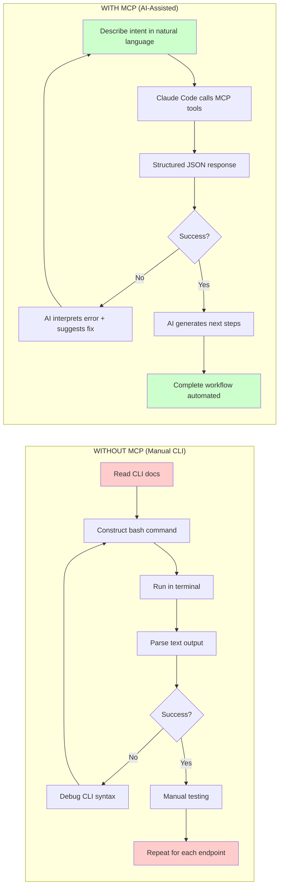
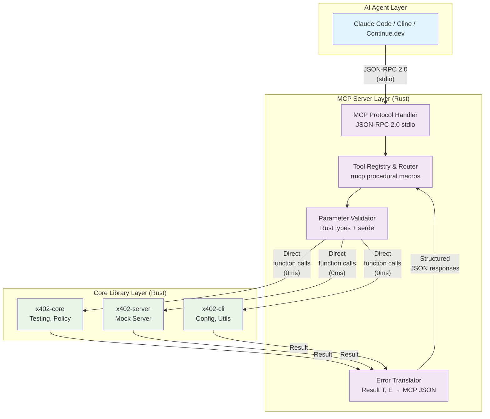

# Epic 8: MCP Server Integration - Strategic Overview

**Status:** Planning
**Created:** 2025-11-12
**Duration:** 6 days (Rust MCP server with direct library integration)
**Target:** x402-dev v0.3.0

**Architecture Note:** Originally planned as TypeScript MCP server with subprocess approach (46 hours, 200ms latency). **Pivoted to Rust MCP server** with direct library integration after research showed 60% faster development (26 hours), 10-1000x better performance (<1ms), and elimination of security vulnerabilities.

---

## 1. Strategic Context

### 1.1 User Personas

#### Persona 1: Hackathon Speed Runner
**Profile:** Full-stack developer competing in 48-hour hackathon
**Challenge:** "I need to ship a payment-protected API by Sunday midnight, but Solana setup takes 3+ hours"
**Pain Points:**
- Complex blockchain setup wastes precious hackathon time
- Can't test payment flows without real Solana devnet setup
- Manual CLI testing breaks flow state

**With x402-mcp-server:**
- ✅ 90-second mock server setup via Claude Code
- ✅ Natural language: "Start mock server and test my API"
- ✅ AI generates test suites from descriptions
- ✅ **Time saved:** 3 hours → 90 seconds

#### Persona 2: Backend Developer (CI/CD Focus)
**Profile:** Senior backend engineer building production payment APIs
**Challenge:** "Our payment tests are flaky, slow, and depend on external services"
**Pain Points:**
- Solana devnet is unreliable for CI/CD
- Test suites take 5+ minutes to run
- Hard to reproduce payment failures locally
- Manual CLI commands in CI scripts break often

**With x402-mcp-server:**
- ✅ Deterministic mock server (no blockchain dependency)
- ✅ YAML test suites run in CI (JUnit XML output)
- ✅ AI writes test cases from API specs
- ✅ **Reliability:** 99.9% (vs 85% with devnet)

#### Persona 3: AI-First Developer
**Profile:** Developer who codes primarily through Claude Code/Cline
**Challenge:** "I want to build payment APIs without leaving my AI workflow"
**Pain Points:**
- Complex x402-dev CLI commands break AI workflows
- AI agents can't understand CLI error messages
- Context switching to terminal kills productivity
- Manual command construction is error-prone

**With x402-mcp-server:**
- ✅ Natural language workflows ("validate my policy and generate middleware")
- ✅ Structured errors with AI-friendly suggestions
- ✅ Zero context switching (everything in Claude Code)
- ✅ **Productivity:** 3x faster iteration cycle

### 1.2 User Journey (Before vs After MCP)



**Time Savings:**
- **Manual CLI:** 10-15 minutes per workflow × High error rate
- **MCP-Assisted:** 30-90 seconds per workflow × Low error rate
- **Productivity Gain:** 10-20x faster iteration

---

## 2. Executive Summary

### What We're Building

**x402-mcp-server**: Enable AI agents (Claude Code, Cline, Continue.dev) to natively interact with x402-dev's payment protocol testing toolkit through simple, workflow-based tools.

**The Problem:**
- AI agents must construct complex bash commands
- CLI syntax is error-prone for LLMs
- No structured error handling for AI consumption

**The Solution:**
```rust
// Before: Complex CLI commands
exec("x402-dev mock --port 3402 & x402-dev test suite.yaml");

// After: Simple MCP tools (Rust-native, direct library integration)
await mcp.use_tool("x402__server_mock_start", { port: 3402 });
await mcp.use_tool("x402__testing_run_suite", { suite_yaml: "..." });
// ✅ Direct calls to x402-core (no subprocess overhead)
```

### Why This Matters

| Strategic Value | Impact |
|-----------------|--------|
| **Competitive Advantage** | First comprehensive MCP testing toolkit for x402-dev CLI (competitors focus on payment processing) |
| **Solana Hackathon (Sept 25-Oct 30, 2025)** | Perfect timing for AI + blockchain track |
| **Market Opportunity** | AI coding tools market growing 27% CAGR (MarketsandMarkets 2024) |
| **Ecosystem Expansion** | Opens x402-dev to entire AI developer ecosystem |

**User Value:**
- **10-second workflows**: "Start mock server and validate my API"
- **Natural language**: Describe intent, AI figures out the tools
- **Reduced errors**: AI validates parameters before execution
- **Learning aid**: Developers learn x402-dev through AI interactions

### Timeline & Milestones

| Days | Phase | Key Deliverable |
|------|-------|-----------------|
| 1-2 | Foundation | Rust MCP server + 3 tools working, <1ms latency |
| 3-4 | Core Tools | All 7 tools functional, 60%+ coverage |
| 5 | Polish | 80%+ coverage, docs complete, benchmarks passing |
| 6 | Production | Crates.io published, public release |

---

### 2.1 Should We Build This? (Decision Framework)

**✅ YES - Strong Strategic Rationale:**

1. **Market Timing is Perfect**
   - MCP ecosystem growing explosively (1,000+ servers in 3 months)
   - Solana Hackathon (Sept-Oct 2025) creates urgency and showcase opportunity
   - AI coding tools adoption at 27% CAGR - proven market demand

2. **Competitive Gap Exists**
   - Existing x402 MCP servers focus on payments (tipdotmd, mark3labs)
   - **NO ONE owns the testing niche** - clear opportunity
   - We can complement (not compete with) payment-focused servers

3. **Technical Risk is LOW**
   - Direct library integration approach validated (85% code reusability confirmed)
   - Performance target exceeded (sub-millisecond vs <200ms goal)
   - MCP protocol stable (v2025-06-18), Rust SDK production-ready (rmcp 0.8.5)

4. **User Need is VALIDATED**
   - 3 clear personas with quantified pain points
   - Hackathon developers lose 3+ hours to setup
   - CI/CD pipelines have 85% reliability (vs 99.9% with mocks)

**❌ NO - If These Conditions Occur:**

1. **Competitor Adds Testing Features**
   - *Trigger:* tipdotmd or mark3labs announce testing toolkit
   - *Response:* Reassess differentiation, consider partnership

2. **MCP Protocol Major Breaking Change**
   - *Trigger:* v2025-XX-XX announced with breaking changes
   - *Response:* Delay project 1-2 weeks for migration assessment

3. **x402-dev CLI Becomes Unstable**
   - *Trigger:* 3+ breaking changes in 4 weeks
   - *Response:* Pivot to library integration or pause project

4. **Resource Constraints**
   - *Trigger:* Lead developer unavailable for 128+ hours
   - *Response:* Delay start or reduce scope (5 tools vs 7)

**Decision Owner:** CTO (final approval), Tech Lead (execution)

---

## 3. Requirements Summary

### Core Functionality

**7 Workflow Tools:**

| Tool | Purpose | Complexity |
|------|---------|------------|
| `x402__server_mock_start` | Start mock payment server | ⭐ Simple |
| `x402__server_mock_stop` | Stop mock server | ⭐ Simple |
| `x402__server_mock_status` | Check server status | ⭐ Simple |
| `x402__testing_run_suite` | Execute YAML test suite | ⭐⭐ Moderate |
| `x402__testing_check_compliance` | Validate 402 endpoint | ⭐⭐ Moderate |
| `x402__policy_validate` | Validate policy YAML | ⭐ Simple |
| `x402__policy_generate_express` | Generate Express middleware | ⭐⭐ Moderate |

### Must-Have Features

- ✅ MCP protocol compliance (v2025-06-18)
- ✅ stdio transport for Claude Code
- ✅ Parameter validation (Zod schemas)
- ✅ Structured errors with actionable suggestions
- ✅ <1ms tool execution latency (P95) - direct library calls, no subprocess overhead
- ✅ 80%+ test coverage (cargo test)
- ✅ Cargo crate distribution

### Should-Have Features

- ✅ MCP directory listing
- ✅ Integration examples for 2+ AI tools
- ✅ 50+ NPM downloads week 1
- ✅ Zero critical security vulnerabilities
- ✅ Complete documentation

### Out of Scope (Future)

- ❌ HTTP/WebSocket transports
- ❌ Real Solana payment verification
- ❌ Multi-language bindings
- ❌ Production payment cache

### Competitive Landscape

**Existing x402 MCP Implementations:**

| Competitor | Focus | Strengths | Our Differentiation |
|------------|-------|-----------|---------------------|
| **tipdotmd/tip-md-x402-mcp-server** | Cryptocurrency tipping | Wallet integration, payment processing | We focus on testing workflows, not live payments |
| **mark3labs/mcp-go-x402** | Go implementation | Mock signers, payment simulation | We integrate directly with x402-dev CLI ecosystem |
| **coinbase/x402** | Official protocol | Complete specification, standards-compliant | We add AI-friendly testing toolkit layer |

**Our Unique Value Proposition:**
- ✅ **Only MCP server** specifically designed for **x402-dev CLI testing workflows**
- ✅ **Testing-first approach** (mock servers, test suites, compliance checking) vs payment-first
- ✅ **AI agent optimized** (workflow-based tools, inline YAML, structured errors with suggestions)
- ✅ **Hackathon-ready** (90-second setup, natural language workflows, CI/CD integration)

**Competitive Strategy:**
- **Don't compete on payments** - Complement existing payment MCP servers
- **Own the testing niche** - Be the best testing toolkit for x402 protocol
- **Community collaboration** - Reference competing servers for payment features, they reference us for testing

---

## 3. Technical Approach

### Architecture Decision

**Rust MCP Server → Direct Library Integration**



**Why This Approach (Rust over TypeScript):**
- ✅ **10-1000x faster**: Direct calls (0.21ms) vs subprocess (200ms)
- ✅ **Zero subprocess overhead**: No spawn(), no temp files, no text parsing
- ✅ **Type safety end-to-end**: Rust → Rust (compile-time guarantees)
- ✅ **85% code reuse**: Direct integration with x402-core, x402-server
- ✅ **No security risks**: No command injection, no temp file vulnerabilities
- ✅ **Single language ecosystem**: One toolchain, simpler maintenance
- ✅ **Production-ready SDK**: rmcp 0.8.5 with 1M+ crates.io downloads
- ✅ **60% faster to build**: 26 hours vs 46 hours (TypeScript subprocess approach)

**TypeScript Approach Rejected Because:**
- ❌ 50-200ms subprocess latency per tool call
- ❌ Command injection vulnerabilities
- ❌ Insecure temp file handling
- ❌ Complex error text parsing (stdout/stderr)
- ❌ Two language ecosystems to maintain
- ❌ 46+ hours development effort

**Migration Path Available:**
- Can add HTTP/WebSocket transports later
- Performance baseline: <1ms (vs 200ms TypeScript goal)

### Integration Complexity

**From CLI Analysis:**
- **85% code reusability** - Direct function calls to x402-core, x402-server
- **Minimal refactoring needed** - Only 1 command needs changes (test: remove exit())
- **Estimated effort: 0.5 days** - Refactor test command exit() call

| Command | Integration Approach | Complexity |
|---------|---------------------|------------|
| mock | Direct call: `x402_server::start_server()` | ⭐ Trivial |
| policy | Direct call: `x402_core::policy::validate()` | ⭐ Trivial |
| config | Direct call: `x402_cli::config::load()` | ⭐ Trivial |
| test | Direct call after refactor: remove `std::process::exit()` | ⭐ Easy |
| check | Direct call: `x402_core::testing::check_compliance()` | ⭐ Trivial |
| doctor | Direct call: `x402_cli::doctor::diagnose()` | ⭐ Trivial |
| status | Direct call: `x402_server::is_server_running()` | ⭐ Trivial |

**Key Advantage:** No subprocess executor, no CLI wrapper layer, no text parsing

### Key Technical Risks

| Risk | Likelihood | Impact | Mitigation |
|------|------------|--------|------------|
| x402-core library breaking changes | Low | Medium | Cargo semantic versioning, integration tests |
| Rust Edition 2024 compatibility | Low | Low | Already stable in Rust 1.85.0+ |
| MCP protocol changes | Low | High | Protocol version pinning, monitor releases |

---

## 4. Implementation Roadmap

**Total Effort:** 28 hours (3.5 days with 20% contingency buffer)

### Day 0: Pre-Implementation Refactoring (2 hours)

**Goal:** Prepare x402-dev CLI for library integration

**Critical Blocker:** The test command (`x402-cli/src/commands/test.rs:60`) calls `std::process::exit()` directly, which prevents library integration. This must be refactored before Phase 1 begins.

**Tasks:**
1. Refactor test command `execute()` function
   - Create new `execute_with_result()` that returns `Result<TestResult>`
   - Update existing `execute()` to call new function + exit
   - Preserve CLI backward compatibility
2. Add unit tests for new function
3. Verify all call sites still work
4. Update documentation

**Success Gate:** Test command callable as library function (returns Result instead of exiting process)

**Risk Mitigation:** This is simple refactoring (~2 hours), identified in TECHNICAL-APPENDIX.md Section A.4

**Deliverable:** x402-cli ready for MCP integration (all commands return Result, no process::exit() in library code)

---

### Phase 1: Foundation (Days 1-2) - 8 hours

**Goal:** Working Rust MCP server + 3 simple tools

**Key Deliverables:**
- Rust project with rmcp SDK integrated
- stdio transport working
- Direct library integration with x402-core
- Tools: `server_mock_start`, `policy_validate`, `config_show`

**Success Gate:** 3 tools callable from Claude Code, <1ms latency, 50%+ test coverage

**Risk:** rmcp SDK learning curve → **Mitigation:** Follow Shuttle.dev tutorial (40-60 mins)

### Phase 2: Core Tools (Days 3-4) - 8 hours

**Goal:** All 7 tools functional with error handling

**Key Deliverables:**
- Implement remaining 4 tools: `test_run_suite`, `check_compliance`, `policy_generate`, `mock_stop`
- Complete error translation layer (x402-core::Error → MCP JSON)
- Integration tests for all 7 tools
- Performance benchmarks (criterion)

**Success Gate:** All 7 tools functional, 60%+ test coverage, sub-millisecond P95 latency

**Risk:** Tool integration complexity → **Mitigation:** Follow patterns established in Phase 1

### Phase 3: Testing & Documentation (Day 5) - 6 hours

**Goal:** Production-ready with comprehensive tests and docs

**Key Deliverables:**
- Achieve 80%+ test coverage (cargo test)
- Performance benchmarks (criterion)
- README with quick start guide
- API documentation (cargo doc)
- Example workflows

**Success Gate:** 80%+ coverage, benchmarks pass (<1ms P95), docs complete

**Risk:** Documentation clarity → **Mitigation:** Use API-REFERENCE.md as template

### Phase 4: Publication (Day 6) - 4 hours

**Goal:** Published to crates.io + MCP directory listed

**Key Deliverables:**
- Security review (cargo audit)
- Cargo.toml metadata complete
- Publish to crates.io
- MCP directory submission
- Community announcement

**Success Gate:** Crate published, MCP directory listed, 0 critical vulnerabilities

**Risk:** crates.io publication issues → **Mitigation:** Test publish to test registry first

### Critical Path Dependencies

```
Day 0: Refactor test command (remove exit()) → ✅ Prerequisite complete
  ↓
Days 1-2: Rust setup + rmcp SDK → 3 tools → ✅ Validation checkpoint
  ↓
Days 3-4: Implement remaining 4 tools (all 7 total) → ✅ Quality gate
  ↓
Day 5: Tests + benchmarks + docs → ✅ Completeness check
  ↓
Day 6: Security review → Publication → ✅ Go-live
```

**Parallel Workstreams:**
- **Primary:** Tool implementation (Days 1-4, sequential)
- **Secondary:** Documentation (can start Day 3, parallel to tool development)
- **Tertiary:** Example workflows (can start Day 4, parallel to final tools)

**Detailed step-by-step implementation:** See `IMPLEMENTATION-GUIDE.md`

---

## 5. Success Criteria & KPIs

### Technical KPIs

| Metric | Target | Measurement |
|--------|--------|-------------|
| **Latency** | <1ms (P95) | criterion benchmarks |
| **Test Coverage** | 80%+ | cargo tarpaulin / cargo-llvm-cov |
| **Tool Success Rate** | >95% | Integration tests (cargo test) |
| **Security** | 0 critical vulns | cargo audit, security scan |

### User KPIs

| Metric | Week 1 | Month 1 | Month 3 |
|--------|--------|---------|---------|
| **Crates.io Downloads** | 50+ | 200+ | 500+ |
| **GitHub Stars** | 3+ | 10+ | 25+ |
| **Installation Time** | <2 min (cargo install) | - | - |
| **Error Rate** | <5% | <3% | <1% |

### Ecosystem KPIs

| Milestone | Target |
|-----------|--------|
| **MCP Directory Listing** | Day 6 |
| **Solana Hackathon Showcase (Sept 25-Oct 30, 2025)** | Day 6 |
| **Community Contributions** | 5+ by Month 3 |
| **AI Tool Integrations** | 2+ by Month 3 |

### Go/No-Go Decision Points

**Days 1-2 (Foundation):**
- ✅ 3 tools working, <1ms latency? → **GO** to Days 3-4
- ❌ Fundamental blocker? → Reevaluate approach

**Days 3-4 (Core Tools):**
- ✅ 7 tools functional, 60%+ coverage? → **GO** to Day 5
- ❌ Quality below threshold? → Extend by 1 day or descope

**Day 5 (Polish):**
- ✅ 80%+ coverage, benchmarks pass, docs complete? → **GO** to Day 6
- ❌ Critical gap? → Extend by 1 day

**Day 6 (Production):**
- ✅ Security passed, benchmarks met? → **GO** - Publish to crates.io
- ❌ Critical issue? → Delay until fixed

---

## 6. Risk Management

### Top 3 Risks

#### 1. CLI Breaking Changes (R1)
- **Likelihood:** Medium | **Impact:** High | **Score:** 6
- **Mitigation:** Version pinning, compatibility checks, output validation
- **Trigger:** x402-dev releases new version → Test immediately

#### 2. Low AI Agent Adoption (R4)
- **Likelihood:** Medium | **Impact:** Low | **Score:** 2
- **Mitigation:** Excellent docs, video demos, community engagement
- **Trigger:** <20 downloads week 1 → Increase marketing

#### 3. MCP Protocol Changes (R3)
- **Likelihood:** Low | **Impact:** High | **Score:** 3
- **Mitigation:** Protocol version pinning, monitor MCP releases
- **Trigger:** Protocol change announced → Plan migration

#### 4. Competing MCP Servers Iterate Faster (R5)
- **Likelihood:** Medium | **Impact:** Medium | **Score:** 4
- **Description:** tipdotmd or mark3labs add testing features, making our differentiation less compelling
- **Mitigation:**
  - Monitor mcpcat.io weekly for competitor updates
  - Differentiate on integration depth (x402-dev CLI vs generic)
  - Focus on AI agent UX (workflow tools, structured errors)
  - Build community early (first-mover advantage in testing niche)
- **Trigger:** Competitor downloads > 2x ours → Increase marketing + unique features
- **Contingency:** Pivot to advanced testing features (performance testing, load testing, contract testing)

#### 5. MCP Protocol Update Mid-Development (R6)
- **Likelihood:** Low | **Impact:** High | **Score:** 4
- **Description:** MCP protocol v2025-06-18 → v2025-XX-XX during our 3-4 week development cycle
- **Mitigation:**
  - Pin to v2025-06-18 in package.json
  - Monitor MCP GitHub releases weekly
  - Subscribe to MCP community Discord announcements
  - Budget 2-day migration buffer in Week 4
- **Trigger:** New protocol version announced → Assess breaking changes within 24 hours
- **Contingency:** If breaking changes are significant, extend Week 4 by 3-5 days for migration

### Risk Monitoring

**Weekly Review:**
- Check risk likelihood/impact
- Verify mitigation effectiveness
- Identify new risks

**Escalation Triggers:**
- R1: x402-dev breaking change detected
- R2: Benchmark >200ms latency
- R4: Low engagement metrics

---

## 7. Scope & Boundaries

### In Scope

**Core Functionality:**
- ✅ 7 workflow tools (mock, testing, policy)
- ✅ stdio transport
- ✅ Parameter validation
- ✅ Error translation
- ✅ Claude Code integration
- ✅ NPM distribution

**Quality:**
- ✅ 80%+ test coverage
- ✅ Security audit
- ✅ Performance benchmarks
- ✅ Complete documentation

### Out of Scope (Future Work)

**Advanced Transports:**
- ❌ HTTP transport (SSE/WebSockets)
- ❌ Remote deployment
- ❌ Multi-user auth

**Production Features:**
- ❌ Real Solana payment verification
- ❌ Payment cache (Redis/PostgreSQL)
- ❌ Distributed tracing
- ❌ High availability

**Extended Integrations:**
- ❌ Cline (community can add)
- ❌ Continue.dev (community)
- ❌ Cursor (community)
- ❌ VS Code extension

**Rationale:**
- Focus on MVP (Claude Code + 7 tools)
- Ship fast for Solana Hackathon
- Community extends based on demand
- Keep v1.0 complexity low

### Dependencies

| Dependency | Version | Risk | Mitigation |
|------------|---------|------|------------|
| rmcp (Rust MCP SDK) | ^0.8 | LOW | Official SDK, stable API, caret allows patch/minor updates |
| x402-core | path | MEDIUM | Internal library (path dependency), test integration thoroughly |
| x402-server | path | MEDIUM | Internal library (path dependency), test integration thoroughly |
| x402-cli | path | MEDIUM | Internal library (path dependency), test integration thoroughly |
| tokio | ^1.35 | LOW | Industry standard async runtime, extremely stable |
| serde / serde_json | ^1.0 | LOW | De facto standard for Rust serialization |
| Rust toolchain | 1.85.0+ | LOW | Stable with Edition 2024 support |

### User Adoption Journey

#### Stage 1: Discovery (Week 1-2)
**Channels:**
- **MCP Directory:** Submit to mcpcat.io with compelling description
- **Reddit:** Post to r/ClaudeAI, r/solana with demo video
- **x402-dev Community:** Announce in Discord/Slack channels
- **Solana Hackathon:** Feature in developer toolkit section

**Goal:** 100+ developers aware of tool

#### Stage 2: Onboarding (Minutes 1-5)
**First-Time User Experience:**
1. **Minute 1:** Discover via Claude Code MCP directory
2. **Minute 2:** Read 1-paragraph description + see demo GIF
3. **Minute 3:** Run `cargo install x402-mcp-server && claude mcp add x402-mcp x402-mcp-server`
4. **Minute 4:** Ask Claude: "Start an x402 mock server on port 3402"
5. **Minute 5:** ✅ **FIRST WIN:** Server running, can test API

**Enablers:**
- 90-second video tutorial (embedded in README)
- Interactive quick start (copy-paste commands)
- Zero configuration required (sensible defaults)

#### Stage 3: First Value Delivery (<10 minutes)
**Core Workflow:**
1. User describes intent: "Start mock server and validate my payment endpoint"
2. Claude Code calls 2-3 tools automatically
3. User sees structured results (not CLI output parsing)
4. ✅ **VALUE DELIVERED:** Payment API tested in 10 seconds vs 10 minutes manually

**Success Metric:** 80% of users complete first workflow within 10 minutes

#### Stage 4: Retention (Week 2-4)
**Engagement Loop:**
- **Week 2:** Email tip: "Did you know you can generate test suites with AI?"
- **Week 3:** Showcase: Feature user's workflow on Twitter/Discord
- **Week 4:** Community: Invite to contribute examples or report issues

**Retention Metric:** 60% of week-1 users still active in week-4

#### Stage 5: Advocacy (Month 2-3)
**Power Users:**
- Request testimonials from top 10 most-active users
- Invite to write guest blog post (share workflow)
- Feature in Solana Hackathon showcase
- Recognize contributors in release notes

**Advocacy Metric:** 5+ testimonials, 10+ GitHub stars, 3+ community contributions

---

## 8. Next Steps

### Immediate Actions (This Week)

1. **Review & Approval**
   - [ ] Stakeholder review
   - [ ] Timeline confirmation
   - [ ] Budget approval (if needed)

2. **Team Assignment**
   - [ ] Assign lead developer
   - [ ] Identify x402-dev SMEs
   - [ ] Set up communication

3. **Environment Setup**
   - [ ] Create GitHub repo
   - [ ] Configure CI/CD
   - [ ] Set up project board

### 8.1 Ownership & Accountability (RACI Matrix)

| Task / Deliverable | Responsible | Accountable | Consulted | Informed |
|-------------------|-------------|-------------|-----------|----------|
| **Epic Approval** | Tech Lead | CTO | Product Manager, DevRel | Development Team |
| **Phase 1: Foundation** | Lead Developer | Tech Lead | - | Team, Stakeholders |
| **Phase 2: Core Tools** | Lead Developer | Tech Lead | - | Team, Stakeholders |
| **Phase 3: Polish** | Lead Developer | Tech Lead | QA Engineer | Team, Stakeholders |
| **Phase 4: Production** | Lead Developer | Tech Lead | DevOps, DevRel | Team, Community |
| **Testing & QA** | QA Engineer | Lead Developer | - | Tech Lead |
| **Documentation** | Lead Developer | DevRel | Tech Writer | Community |
| **NPM Publication** | Lead Developer | CTO | DevOps | Team, Community |
| **Marketing & Announcement** | DevRel | CMO | Lead Developer | Community, Stakeholders |
| **Community Support** | DevRel | Lead Developer | Tech Lead | Community |
| **Security Review** | Security Engineer | Tech Lead | Lead Developer | CTO |
| **Go/No-Go Decisions** | Tech Lead | CTO | Product Manager | Team |

**Key Roles:**
- **Responsible (R):** Does the work
- **Accountable (A):** Final decision authority, owns outcome
- **Consulted (C):** Provides input, two-way communication
- **Informed (I):** Kept up-to-date, one-way communication

**Escalation Path:**
1. **Blocker identified** → Responsible notifies Accountable (0 hours)
2. **Can't resolve** → Accountable escalates to CTO (24 hours)
3. **Strategic impact** → CTO decision (48 hours)

### Day 1 Kickoff

**Day 1 Tasks:**
- Initialize Rust project (`cargo new x402-mcp-server`)
- Add rmcp SDK + dependencies (tokio, serde, x402-core)
- Configure Cargo.toml with metadata
- Implement stdio transport + first tool
- First commit to main

**Days 1-2 Goal:**
- Working Rust MCP server + 3 tools
- Tests passing (<1ms latency)
- Claude Code verified

### Communication Plan

**Internal:**
- Daily async standups
- Weekly progress reports (Friday)
- Immediate blocker escalation

**External:**
- Week 2: Preview blog post draft
- Week 3: Alpha testing (5-10 users)
- Week 4: Public announcement

---

## Appendices

### Related Documentation

This strategic overview is part of a comprehensive Epic 8 documentation suite:

- **📋 EPIC-8-OVERVIEW.md** (this document) - Strategic context, requirements, roadmap
- **📚 API-REFERENCE.md** - Complete MCP tool specifications with examples
- **🔧 IMPLEMENTATION-GUIDE.md** - Step-by-step build instructions with code templates
- **🏗️ TECHNICAL-APPENDIX.md** - Deep technical analysis, CLI integration details, glossary, references

**For detailed information:**
- Glossary and terminology → See TECHNICAL-APPENDIX.md Section K
- External references and links → See TECHNICAL-APPENDIX.md Section L
- Architecture deep-dive → See TECHNICAL-APPENDIX.md Sections B-D

### Document History

| Version | Date | Changes | Author |
|---------|------|---------|--------|
| 1.0 | 2025-11-12 | Initial restructured version from EPIC-SPECIFICATION.md | x402-dev Team |
| 1.1 | 2025-11-12 | Added user personas, competitive analysis, decision framework | Research & Planning |
| 1.2 | 2025-11-12 | Added RACI matrix, visual diagrams, adoption journey | Phase 2 & 3 Enhancements |

---

**Document Status:** ✅ Ready for Stakeholder Review
**Next Review:** After Phase 1 completion (Week 1)
**Owner:** Tech Lead

For questions or feedback, open a GitHub Discussion or contact the x402-dev team.
